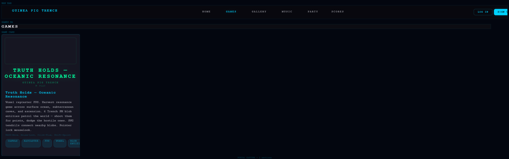

# Guinea Pig Trench Portal



**[Play Now](https://commencethescourge.github.io/guinea-pig-trench-portal/)** — 40+ original browser games, 129 music tracks, 5 worlds. Pure canvas, WebGL, and Web Audio API. Every asset is original IP.

Copyright (c) 2026 Guinea Pig Trench LLC (PA #13674084)
Credit Facility: Truth Holds Enterprise (PA #7049023)

---

> The *between* IS the product. The *mistake* IS the signal. The *almost* IS the always.

## What's Here

- **40+ games** — raymarched worlds, voxel FPS, lenticular 3D, tower defense, fighting, trading, puzzles, rhythm, card battles, procedural terrain
- **129 music tracks** — 18 SoundClick originals + 111 refined/expression variants. Auto EQ, pitch correction, fluid vial controls
- **P2P Party** — voice, video, chat, proximity cypher. Serverless WebRTC via Trystero
- **5 worlds** — Pink Hour, The Block, The Threshold, Vault Compound 7, The Between

## Games (40+)

| Game | Description |
|------|-------------|
| Sprite Brawler | 2D fighting game with sprite variants |
| Void Runner | Ship builder and space runner |
| Terrain Walker | Procedural terrain exploration |
| Threshold Dungeon | Roguelike dungeon crawler |
| UFO Defense | Tower defense against UFOs |
| Voxel Engine | 3D voxel world builder |
| Sluice Gate | Logic puzzle game |
| Sand Garden | Procedural zen garden |
| Sph Fluid | Real-time fluid simulation |
| Sprite Sculptor | Sprite creation tool |
| Starfield 4D | 4D starfield explorer |
| Stealth Maze | Stealth puzzle game |
| Dim Mak Dojo | Martial arts trainer |
| Fractal Forge | Fractal generator |
| And 25+ more... | |

## The Sieve Connection

The same modular sieve that verified the [Erdos-Straus conjecture](https://github.com/COMMENCINGTHESCOURGE/erdos-straus-solver) to 10^17 seeds the game balance, shapes the terrain, drives the lenticular lens, and curves the EQ on every beat.

- **The Field** — 250K numbers on an Ulam spiral. Click to hear prime factors as SoundClick beat snippets. Toggle mod-24 to see sieve survivor channels.
- **Prime Sieve** — You ARE a number. Fly through modular filter gates.
- **Sieve Visualizer** — Watch 10^17 sweep in real time.

## Architecture

The portal is a single-page application with no build step. The game shell (`js/game-shell.js`) loads HTML games dynamically. Music routes through a shared audio engine. Party mode uses serverless WebRTC.

| Feature | Implementation |
|---------|---------------|
| Rendering | WebGL2 raymarching, SDF scenes, orbit trap palettes |
| Audio | Web Audio API, Auto EQ (5-band), AutoTube pitch correction |
| Music | 129 tracks, persistent player, fluid vial volume/pitch controls |
| Multiplayer | Trystero P2P (BitTorrent trackers), no server needed |
| Sprites | Face-forge pipeline: 2D → heightmap → displaced mesh → .glb |
| Loading | Pass 1 (6 scripts) / Pass 2 (13 deferred) |

## Run Locally

```bash
python -m http.server 8080
```

Open http://localhost:8080. No build step. No npm. No frameworks.

## Repository Structure

```
/
├── index.html              # Portal entry point
├── guineapigtrench.html    # Secondary landing
├── games/                  # 40+ HTML game files
│   ├── js/                 # Game-specific JS
│   └── refined/            # Refined/optimized versions
├── js/                     # Shared engine
│   ├── game-shell.js       # Game loader
│   ├── music.js            # Music engine
│   ├── router.js           # Page router
│   └── party/              # P2P party system
├── assets/                 # Sprites, gallery, icons
│   ├── gallery/            # Character/enemy/UI art
│   ├── sprites/            # Animated sprite sheets
│   └── lore/               # Entity backstories
├── css/                    # Stylesheets
├── music/                  # Music processing scripts + metadata
├── colab/                  # Colab notebooks for asset gen
└── kaggle_fleet/           # Kaggle pipeline scripts
```

## Entity

| Field | Value |
|-------|-------|
| Copyright | Guinea Pig Trench LLC |
| R&D Entity | Guinea Pig Trench LLC (PA, #13674084) |
| Credit Facility | Truth Holds Enterprise (PA #7049023) |
